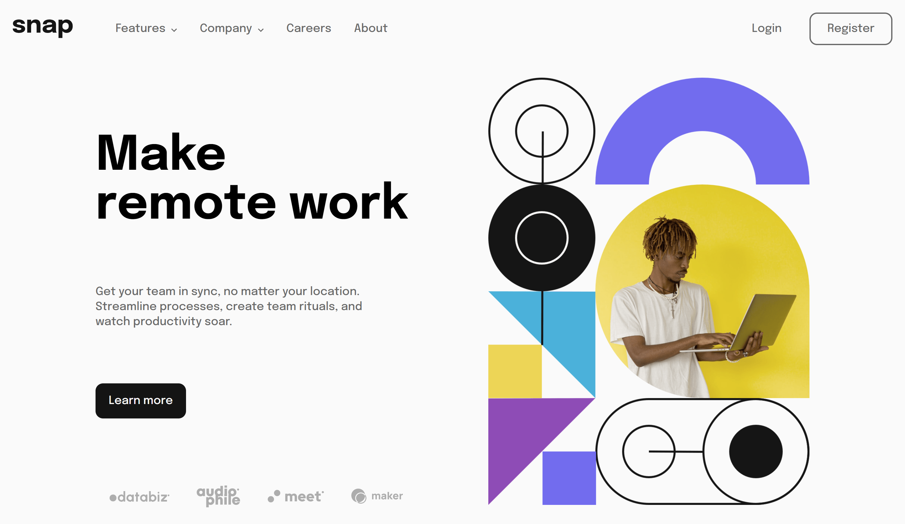

# Frontend Mentor - Company intro section with dropdown navigation solution

This is a solution to the [Intro section with dropdown navigation challenge on Frontend Mentor](https://www.frontendmentor.io/challenges/intro-section-with-dropdown-navigation-ryaPetHE5). Frontend Mentor challenges help you improve your coding skills by building realistic projects. 

## Table of contents

- [Overview](#overview)
  - [The challenge](#the-challenge)
  - [Screenshot](#screenshot)
  - [Links](#links)
- [My process](#my-process)
  - [Built with](#built-with)
  - [What I learned](#what-i-learned)
  - [Continued development](#continued-development)
  - [Useful resources](#useful-resources)
- [Author](#author)

## Overview

### The challenge

Users should be able to:

- View the relevant dropdown menus on desktop and mobile when interacting with the navigation links
- View the optimal layout for the content depending on their device's screen size
- See hover states for all interactive elements on the page

### Screenshot Preview



### Links

- Live Site URL: [https://tascate.github.io/company-intro-page-with-dropdown-navigation/](https://tascate.github.io/company-intro-page-with-dropdown-navigation/)

## My process

### Built with

- Semantic HTML5 markup
- Mobile-first workflow
- CSS Grid & Flexbox
- CSS Selectors

### What I learned

What I learned during this secton is how to create dropdown and accordion content. For this, I particularly used CSS and a toggle class function in javascript to achieve the effect. The CSS would apply the transition and styling whenever the class was toggled from the Javascript. This easily lets me customize how the visuals.

This was done with the usage of CSS selectors so that only one HTML element would need to a class toggle while child elements would be able to change styles whenever the parent was toggled to open the accordion/dropdown content. CSS selectors are quite useful and I would be sure to use them in the future!

```css
.header-accordion.open+.header-accordion-content {
    max-height: 250px;
}

.header-accordion-content {
    max-height: 0;
    overflow: hidden;
    transition: max-height 0.4s ease-out;
}
```
Particuarly here where the accordion content has a smooth opening or closing animation to hide/show the content whenever its parent container has been toggled open.
### Continued development

Focusing on areas to improve on for future projects would include relying less on static sizes of pxs and using responsive lengths when the situation calls for it. This would made it easier to size content for different display sizes and reduce CSS. I tried doing this for the main content on this webpage and from my personal evaluation, the results seemed adequate enough.

Other points would be utilizing CSS selectors more, particularly becoming comfortable with the :after and :before selectors to see where they would be useful.

### Useful resources

- [CSS Selector References](https://www.w3schools.com/cssref/css_selectors.php) - This helped me for seeing which CSS selector did what. This let me find ways where each selector was useful in my CSS sheet.

## Author

- Frontend Mentor - [@Tascate](https://www.frontendmentor.io/profile/Tascate)